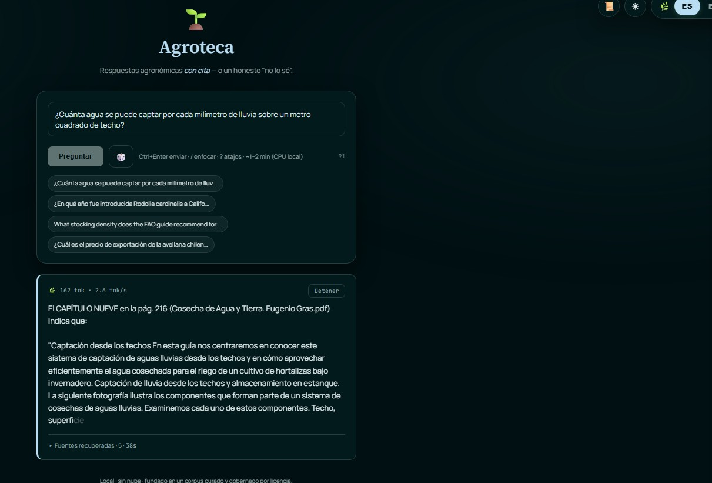
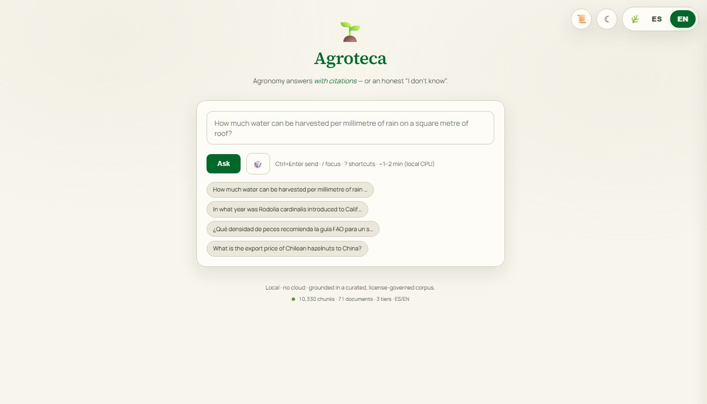
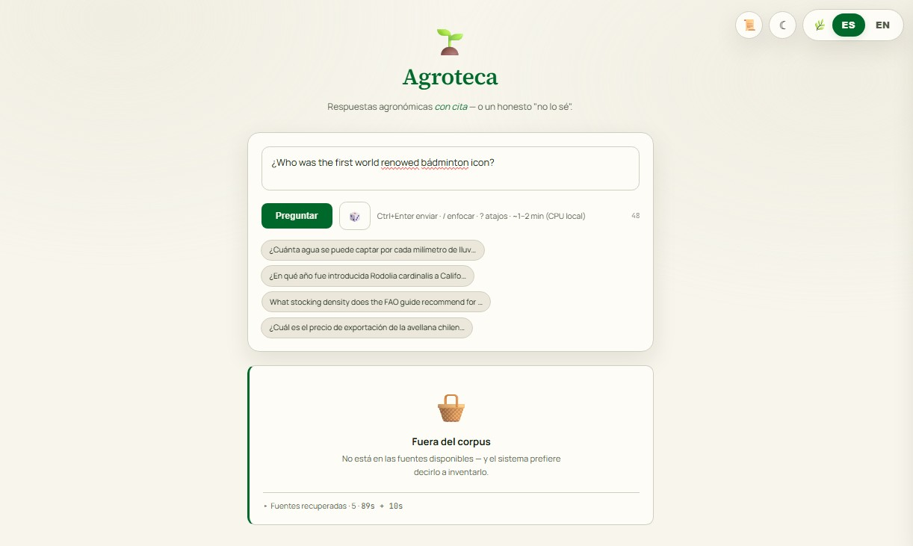

# 🌱 Agroteca

**An eval-first, bilingual (ES/EN) Retrieval-Augmented Generation system over agricultural documents — built measurement-first, with a governed, provenance-aware corpus.**

> **Status: Phases 1–8 complete.** Governed corpus → ingestion → hybrid retrieval → cross-encoder reranking → grounded, cited, **abstaining** generation → a streaming FastAPI service → a polished bilingual **web app** → a **production-hardened serving layer** (config-driven models, a health-checked connection pool, input guardrails, page-precise citations, a startup warm-up that cut the first request from >90 s to 27 s) — all verified against a live running server. The one step left is the public URL, a hosting-cost decision rather than a code problem.
>
> **The number that matters:** retrieval@5 **0.35 (dense) → 0.45 (hybrid) → 0.75 (reranked)** — every step measured against a golden set built *before* the retriever existed (20 answerable questions).
>
> **Beyond the build:** the app is **containerized** (a two-stage `uv` image, non-root, health-checked) over **idempotent, resumable ingestion** — and I ran the embedder upgrade as a **complete controlled experiment**, a full e5-large re-index that *disproved my own hypothesis* and taught me more than a green metric would have (see [Design decisions](#design-decisions-and-why)).

**Stack:** Python · FastAPI · Postgres + pgvector · full-text search · fastembed (ONNX) · a multilingual cross-encoder reranker · Ollama (local LLM) · `uv` · Docker · a self-contained streaming web front end.

---

## Highlights

- **Eval-first, and it earned its keep.** The 22-question golden set was written *before* the retriever, so every change is measured, not guessed — and it once flagged a "hallucination" that turned out to be a **mislabeled ground-truth answer** (I fixed the label, not the model).
- **A measured retrieval cascade.** dense → hybrid (Reciprocal Rank Fusion) → cross-encoder reranking, each stage's gain proven on the golden set: **retrieval@5 0.35 → 0.45 → 0.75**, six questions fixed with **zero regressions**.
- **Grounded and cited — or an honest "I don't know."** Generation answers only from retrieved context, cites its sources **to the page** (`Book.pdf, p. 37`), and abstains (with a canonical, machine-checkable phrase) when the corpus can't answer.
- **A transparency-first web app.** A bilingual, streaming UI where every answer opens a drawer exposing the exact retrieved chunks, their cross-encoder relevance scores, and governance tiers — plus a retrieval-vs-generation latency breakdown. *Show your work.*
- **Provenance as a first-class concern.** A four-tier governed corpus (open / local-only / synthetic / distractor) where the tier controls where a document may appear; copyrighted material is confined to a local-only mode and never shipped publicly.
- **Local-first, measured model choices — and I *ran the experiment*.** A MiniLM embedder and a 3B local LLM, each chosen by *measured* throughput, not hype (e5-large is a benchmarked 50× slower on CPU). When the embedder looked like the bottleneck I didn't guess — I ran the upgrade end-to-end: a controlled cosine pilot, a cheap re-chunk probe, then a full **e5-large re-index**. It **doubled dense retrieval** (0.35 → 0.75) yet barely moved the final number — because the reranker was already *masking* the weak dense — and it **disproved my prediction** that it would fix the cross-lingual misses. I kept the fast model and documented why. *The finding was the value, not the swap.*
- **Hardened by actually running it.** Standing the server up surfaced — and fixed — the bugs no offline test shows: a DB connection that died idle behind Docker's proxy, a timeout that strangled slow-but-correct answers, and an ONNX cold-start that made the first request 3× slower. Config-driven models, a health-checked connection pool, input guardrails, and a startup warm-up now stand between "runs on my laptop" and "serves strangers."

---

## What it is

Agroteca answers agronomy questions — *"which alfalfa variety was used in the INIA trials?"*, *"how much rainwater can a roof harvest?"* — **strictly from a curated document corpus**, in Spanish or English, **with citations**, and with the discipline to say **"I don't know"** when the corpus can't answer.

The domain corpus is anchored on **Chile's INIA** agricultural publications, extended with **FAO**, university extension, CGIAR, and public-domain sources, plus the relevant slice of **Chilean agricultural and food-safety law**.

## Why it's built this way

Most RAG projects build the pipeline, eyeball a few demo questions, and call it done — with no way to know whether any change is an improvement. Agroteca inverts that: **the evaluation set was built before the retrieval system**, so every change is measured, not guessed. This is the single most load-bearing decision in the project — and it has already paid for itself (see [The receipts](#the-receipts)). The full story is in [`notes.md`](notes.md).

---

## Architecture

Two machines: an **offline** indexer (run once) and an **online** query path (run per question).

```
 OFFLINE ─ build the index ─────────────┐    ONLINE ─ answer a question ────────────────────────┐
                                         │                                                       │
 PDFs → extract → normalize → chunk →    │  question → embed → ┌ dense  (pgvector) ┐             │
 embed → store (pgvector + tsvector) ────┼──────────────────── ┤   RRF fusion      ├→ rerank →   │
                                         │                     └ lexical (FTS)     ┘   top-k     │
                                         │                                                ↓       │
                                         │                   local LLM:  GROUND · CITE · ABSTAIN  │
 ────────────────────────────────────────┘ ──────────────────────────────────────────────────────┘
```

Each retrieval stage exists to fix the previous stage's blind spot: dense understands paraphrase but misses exact codes (`WL-323`); lexical nails exact codes but misses paraphrase; hybrid gets both; the cross-encoder reranker sharpens precision before the answer reaches the LLM.

---

## The corpus: four governed tiers

Provenance and licensing are treated as first-class. Every document lives in exactly one tier, and the tier controls where it is allowed to appear. Full policy in [`DATA_GOVERNANCE.md`](DATA_GOVERNANCE.md).

| Tier | Manifest | Loads when | Role |
|---|---|---|---|
| **Open / deployable** | `data/manifest.csv` | always | open-license / gov / public-domain — real citations, safe to deploy publicly |
| **Local-only** | `data/manifest_local.csv` | `LOCAL_MODE` only | copyrighted books — available to the local farm tool, never shipped in a public demo |
| **Synthetic reference** | `data/manifest_synthetic.csv` | always | original, human-verified concept notes grounded in open sources; cited *as* synthetic |
| **Distractor** | `data/manifest_distractor.csv` | eval only | deliberate off-topic hard-negatives; never a valid answer source |

Two principles decide what may enter the answerable corpus: the **idea/expression** distinction (facts are free; copyrighted expression is not) and **citation integrity** (the system never attributes synthesized text to a real source).

---

## Evaluation

The heart of the project is a **golden set** of 22 hand-verified question/answer pairs (`eval/golden_set.jsonl`), deliberately stratified to stress specific parts of the system:

- **Factual lookup** — basic retrieval + extraction
- **Exact-term** (variety codes, cultivar names, species) — the justification for hybrid keyword+semantic search
- **Synthesis** — multi-sentence reasoning
- **No-answer** — measures abstention / hallucination resistance
- **Cross-lingual** (ES question → EN source, and vice-versa) — forces a multilingual embedder

Every answerable question carries a `must_contain` string verified **verbatim against machine-extracted text** (not the source PDF read by eye — a distinction that caught real OCR line-break bugs). Retrieval is scored with a **dual metric** — *answer-chunk@k* (did the exact answer chunk surface?) vs *document@k* (did the right document surface?) — because the gap between them separates a chunking problem from a retrieval problem.

```bash
uv run python eval/validate_golden.py
# OK: 22 questions validated against 71 answerable manifest entries (open + local-only + synthetic tiers)
```

---

## The receipts

Measured on the answerable golden set (k=5), one variable at a time:

| Stage | answer@5 | answer@1 | document@5 | MRR@5 |
|---|---|---|---|---|
| Dense (semantic baseline) | 0.35 | 0.30 | 0.65 | 0.33 |
| + Lexical, fused with RRF (hybrid) | 0.45 | 0.15 | 0.65 | 0.25 |
| **+ Cross-encoder reranking** | **0.75** | **0.75** | **0.90** | **0.75** |

Reranking fixed **six** questions the earlier stages missed, with **zero regressions** — but the sharper story is the ordering columns. `answer@5` only measures membership; **`answer@1` and MRR@5 leap `0.15 → 0.75` and `0.25 → 0.75`**, because whenever the answer is in the pool the reranker **pins it to rank 1**. (Hybrid's `answer@1` *dips below* dense's 0.30 — equal-weight RRF buys pool recall at the cost of top-1 precision, exactly what reranking repairs.)

On generation, the system **abstains on the corpus's genuinely unanswerable questions** rather than fabricating, and a **3B local model matched a 7B on abstention at ~3× lower latency** — chosen by measurement, not assumption.

> An honest footnote (because honesty is the brand): lexical search *alone* scored 0.50 at answer@5 vs the 0.45 hybrid — but that's a **single question** at n=20, within noise. The evidence that actually matters is `doc@5`: **0.85 lexical vs 0.65 hybrid, a four-document gap** — equal-weight RRF was diluting the stronger retriever's recall. That's why the project didn't stop at hybrid; reranking is what decisively won. The full story is in [`notes.md`](notes.md) and [`results/`](results/).

### Latency & what a public deploy actually serves — measured

Two numbers an interviewer asks for, both measured (`eval/compare_retrievers.py`), not assumed:

- **Latency (CPU, per stage).** Bi-encoder **retrieval is production-grade — p95 ≤ 250 ms** (dense 106 ms, hybrid 249 ms). The **cross-encoder reranker is the bottleneck at ~25 s p50 on CPU** — the same free/local-inference tax as generation, and sub-second on a GPU or hosted reranker with *no code change* (it only ever scores the ~20-candidate pool). Full table + levers, including a hybrid-only "fast mode": [`results/latency.md`](results/latency.md).
- **The deployable corpus is smaller than the index.** ~30% of chunks are copyrighted (`local` tier, 11 docs) and can't be served publicly. On the **open + synthetic** corpus a stranger actually gets, the final cascade scores **0.65 answer@5 / 0.75 doc@5** (vs 0.75 / 0.90 on the full index) — lower *only* because two questions (q06, q12) are answered solely by docs a public server can't ship. Same cascade, zero regressions; see the `deploy` row in [`results.csv`](eval/results.csv).

---

## The web app

A local model on CPU is slow (~minutes per answer), so the front end is built to make a slow, honest system *feel* alive and trustworthy:

- **Watch it grow** — a seed→sprout→flower→fruit reel plays during retrieval, then the answer **streams in token by token**. The wait reads as progress, never a freeze.
- **Radical transparency** — every answer carries a one-click **"Sources & retrieval"** drawer: the exact chunks it grounded on, each with a governance-tier badge, a cross-encoder relevance bar, and a snippet — plus a retrieval-vs-generation latency breakdown. *The answer isn't magic; here's the evidence.*
- **Honest by design** — when the corpus can't answer, the card becomes a distinct **empty-basket** state, never a fabricated guess.
- **Bilingual** — a leaf ES/EN toggle localizes the whole UI (and the example questions); the model already answers in the question's language.
- **Product touches** — shareable `?q=` links, session history, keyboard shortcuts, a live health dot, a corpus-stats ribbon, live tokens/sec, a real Stop button, copy/export, and 👍/👎 feedback logged server-side.
- **Designed, not decorated.** A token-driven design system with two OKLCH themes — moonlit *Clair de Lune* (dark) and daylight *Forest* (light), swapped by a single toggle — and a deliberate typographic hierarchy: a serif wordmark, a humanist-sans UI, and a monospace face reserved for every *data* surface (latency, relevance scores, page citations, tier badges). It reads premium because the typography carries the weight, not ornament — and it degrades gracefully to system fonts offline, with hex fallbacks for pre-OKLCH browsers.

The default view stays a calm search box — all of that power reveals only on demand.

```bash
# launch the web app (needs Postgres + pgvector and a local Ollama model)
uv run uvicorn agroteca.api:app --reload
# then open http://127.0.0.1:8000  ·  auto-generated API docs at /docs
```

### Screenshots

<p align="center">
  
</p>

> **Every answer is a receipt.** The drawer exposes the exact chunks it grounded on — each with a governance-tier badge, a cross-encoder relevance score, a **page-level citation**, and a snippet — plus an honest *weak-match* flag when the top score is low, and a breakdown of where the time went. *Show your work.*

<p align="center">
  
  
</p>

> **One app, two themes** — moonlit **Clair de Lune** (dark) and daylight **Forest** (light), a single toggle apart; the data surfaces stay in a monospace face in both.

<p align="center">
  
</p>

> When the corpus genuinely can't answer, an honest **empty basket** — never a fabrication.

---

## From prototype to service — production hardening

A demo that runs on my laptop and a service a stranger can hit are different objects. Closing that gap meant **standing the server up and running it** — the only way to surface the failures that never appear in a unit test. Each of these was found by reading a real traceback, fixed, and re-verified against the running server:

- **Config-driven models.** The LLM, its host, timeouts, pool size, and ONNX thread count are settings, not code — a deploy swaps the slow local model for a fast hosted one with an env var. *This is the single change that makes the app deployable at all.*
- **A health-checked connection pool.** The database is reached through a `psycopg` pool that reuses connections and **validates each one on checkout** — after a live run `500`'d on a connection Docker's proxy had silently killed while idle. The stream path releases its pooled connection *before* the minutes-long generation, so a streamed answer never holds the pool hostage.
- **Guardrails on the public surface.** Bounded input length (a 1 MB "question" can't reach the FTS regex / `tsquery`), `Literal`-validated feedback, and both models **warmed at startup** so concurrent first requests can't each load the 1.1 GB reranker.
- **A timeout that tells slow from broken.** Fail fast if Ollama is unreachable (10 s connect), but stay patient with legitimately slow CPU generation — a flat timeout punishes the honest slow answer.
- **Page-precise citations.** The page was already stored per chunk; surfacing it turns `(Book.pdf)` into `(Book.pdf, p. 37)` — verifiable in one click.
- **A warm-up that made the first request 3× faster.** The first query took **>90 s**, every one after ~25 s: the reranker paid ONNX Runtime's one-time graph optimization on its first *real* inference. Moving that to startup dropped first-request retrieval to **27 s**, measured on the live server.
- **Containerized, and governance-safe by construction.** A two-stage `uv` Docker build — a dependency layer cached off the committed lockfile, a slim **non-root** runtime, a `/health` healthcheck, models in a cache volume — ships the whole app in one **590 MB** image that both **serves *and* ingests**. The copyrighted tier *physically cannot ship*: the Dockerfile never `COPY`s `data/raw`, so governance holds at the image boundary, not just in config. Ingestion is **idempotent and resumable** (`--resume`), so a multi-hour re-index survives an interruption instead of restarting from zero.

```bash
# deploy path — same code, a hosted model, only the open corpus:
AGROTECA_GEN_BASE_URL=https://your-llm-host  AGROTECA_GEN_MODEL=<fast-model> \
  uv run uvicorn agroteca.api:app --host 0.0.0.0 --port 8000
# LOCAL_MODE stays off → the copyrighted tier is never served publicly
```

> Full recipe — env vars, the generation swap (Ollama-compatible host = env var; another provider = a small localized change), and ops notes — in **[`DEPLOY.md`](DEPLOY.md)**.

The loop that produced all of this — run, break, diagnose, fix, re-run — is the difference between a portfolio piece and a product.

---

## Roadmap

| Phase | Deliverable | Ship criterion | Status |
|---|---|---|---|
| 1 | Golden set + governed corpus + validator | validator passes; corpus tiered & text-verified | ✅ **done** |
| 2 | Ingestion: normalize → chunk → embed → pgvector + FTS | corpus indexed (10,330 chunks); `retrieval@5` baseline measured | ✅ **done** → 0.35 |
| 3 | Hybrid retrieval (dense + lexical) fused with RRF | the number moves vs the dense baseline | ✅ **done** → 0.45 |
| 4 | Cross-encoder reranking (precision stage) | rerank@5 beats hybrid on the golden set | ✅ **done** → 0.75 |
| 5 | Grounded, **cited**, **abstaining** generation (local LLM) | answers are cited; no-answer questions abstain | ✅ **done** |
| 6 | Serving: FastAPI + token streaming (NDJSON evidence stream) | a request streams a cited answer end-to-end | ✅ **done** |
| 7 | Web app: bilingual streaming UI + retrieval-transparency drawer | grounded/cited answer *or* honest abstention, evidence one click away | ✅ **done** |
| 8 | Production hardening: config-driven models · pooled + health-checked DB · input guardrails · startup warm-up | verified against a live running server | ✅ **done** |
| 9 | Public URL + write-up | a stranger opens a URL and gets a cited answer | ⏳ a hosting-cost decision |

---

## Design decisions (and why)

| Choice | Rationale |
|---|---|
| **Multilingual MiniLM embeddings** (measured, then *stress-tested*) | cross-lingual questions rule out an English-only model; MiniLM-384 was chosen over e5-large by **measured** CPU throughput (50× faster) — then I **ran the e5-large upgrade end-to-end**: it doubled *dense* recall, but the reranker had been masking that, so the final barely moved. I kept MiniLM and recorded the tradeoff rather than pay 8× query latency + a `VECTOR(1024)` migration for a noise-level gain |
| **Postgres + pgvector** | metadata filtering, keyword search, and vector search in one store; production-credible; tiers enforced in SQL |
| **Hybrid + Reciprocal Rank Fusion** | dense search misses exact codes (`WL-323`); lexical search misses paraphrase; fusing by *rank* (not score) sidesteps the incomparable score scales |
| **Cross-encoder reranker** | reads each (query, chunk) pair *together* to sharpen the top candidates before the LLM — retrieval quality is the ceiling on answer quality |
| **Local LLM · ground / cite / abstain** | grounded generation with citations and a canonical abstention phrase; rules live in the **system** role to resist prompt injection from retrieved chunks; a local 3B model keeps inference free, offline, and copyrighted chunks on-device |
| **Config-driven serving** | the model, host, timeouts, pool size, and ONNX thread count are settings, not code — a deploy points at a hosted GPU model (or bounds concurrency) with an env var, no source edit |
| **Deterministic eval, RAGAS-ready** | deterministic `must_contain` / retrieval@k checks run cheaply and gate every change; semantic faithfulness (RAGAS) is the documented next layer |

---

## Repository layout

```
data/
  manifest*.csv           # the four governed tiers (open / local / synthetic / distractor)
  synthetic/              # grounded synthetic reference notes (*.md)
  raw/                    # source PDFs (gitignored)
eval/
  golden_set.jsonl        # 22 hand-verified Q/A pairs
  validate_golden.py      # structural + tier-membership validator
  compare_retrievers.py   # dense vs lexical vs hybrid vs rerank, on the golden set
  eval_generation.py      # abstention + citation + latency on generated answers
src/agroteca/
  ingest/                 # extract · normalize · chunk · embed · store
  retrieve/               # dense · lexical · fusion (RRF) · hybrid · rerank
  generate.py             # ground / cite / abstain generation (+ NDJSON streaming)
  api.py                  # FastAPI service: /ask/stream, /stats, /feedback, /health
  static/index.html       # the self-contained bilingual streaming web app
stream_client.py          # tiny terminal client for the streaming endpoint
migrations/               # pgvector + full-text schema
Dockerfile .dockerignore  # two-stage uv build; one non-root image serves + ingests
DEPLOY.md                 # deploy recipe: hosted-model swap, LOCAL_MODE, container run
docs/                     # ingestion spec + teaching notes
results/                  # measured before/after for each phase
DATA_GOVERNANCE.md        # the four-tier provenance/licensing policy
notes.md                  # build journal (the "why", with war stories)
```

## Running it

Python is managed with **[uv](https://docs.astral.sh/uv/)** (Python 3.12). The retrieval and generation stack needs **Postgres + pgvector** (via Docker) and a local **[Ollama](https://ollama.com)** model for generation.

```bash
# 1. evaluation foundation (no services required)
uv run python eval/validate_golden.py

# 2. compare retrievers on the golden set  (needs Postgres + pgvector, corpus ingested)
uv run python eval/compare_retrievers.py --k 5

# 3. a grounded, cited answer from the real corpus  (needs Postgres + Ollama)
uv run python src/agroteca/generate.py

# 4. the full web app  (needs Postgres + pgvector + Ollama)
uv run uvicorn agroteca.api:app --reload   # then open http://127.0.0.1:8000
```

---

## Licensing & provenance

Source documents retain their original licenses. Only open-license / public-domain / government material is served by any public deployment; copyrighted material is confined to the local-only tier and is never redistributed. Chilean official legal texts are public domain (Ley 17.336 art. 88). See [`DATA_GOVERNANCE.md`](DATA_GOVERNANCE.md).

---

*Built as a portfolio project. The interesting parts are the decisions, not the line count.*
