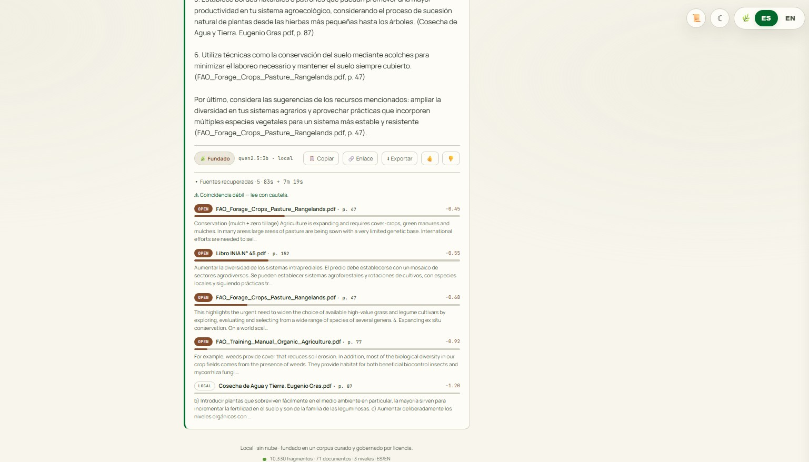

# I Wrote the Final Exam Before I Built the Student

> **The 60-second version.** A three-part build journal of an eval-first, bilingual agricultural RAG. I wrote the evaluation *before* the retriever, then measured every change: retrieval@5 climbed **0.35 → 0.45 → 0.75** (dense → hybrid → cross-encoder reranked). Answers are grounded in cited sources — or honestly abstain — and along the way the system's own eval caught a *mislabeled* ground-truth answer. **Part 1** builds the governed corpus (with war stories); **Part 2** builds the measured retrieval + generation engine; **Part 3** turns it into a streaming, transparent web app; **Part 4** hardens it into a service that survives real traffic — the bugs you only find by *running* it. The through-line: *measure before you build, distrust your own metrics, show your work, know when to say "I don't know," and run it before you believe it.*

### Notes from building an eval-first agricultural RAG — Part 1: the foundation nobody blogs about

Most RAG tutorials follow the same five-step recipe: load documents, embed them, search, answer, ship. It takes an afternoon and produces something that demos beautifully for exactly three questions and falls apart on the fourth.

I did it backwards on purpose. I refused to write a single line of retrieval code until I had a way to *prove* whether retrieval worked. This post is about that decision and the war stories from getting there — the unglamorous half of RAG that decides whether the glamorous half is any good.

Fair warning: this part has no graphs. It has a 0-byte chemistry file, an astrology treatise, and a digit that stopped being a digit. Part 2 gets the graphs.

---

## The pile

The project is a bilingual (Spanish/English) question-answering system over agricultural documents — think a knowledgeable farm advisor that only speaks from real sources and refuses to make things up. The raw material was a folder of ~68 PDFs.

Some of it was gold: Chile's INIA agricultural institute publishes beautiful, dense books on citrus pests, walnut cultivars, alfalfa varieties, biological pest control. Exactly the domain.

Some of it was… not. In the same folder I found a 1822 treatise on astrology (Ptolemy's *Tetrabiblos*), a book on Chinese geomancy, two separate cannabis grow bibles, several robotics textbooks, and — my favorite — a file heroically named `Organic Chemistry.pdf` weighing in at **zero bytes**. Zero bytes of organic chemistry. The purest possible form.

The lesson underneath the comedy is real: **a corpus is not a library you're proud of — it's the search space your retriever has to be correct within.** Every irrelevant document is a landmine your system can step on when someone asks a slightly ambiguous question. So step one wasn't "add more." It was deciding what *didn't* belong.

## The contrarian move: build the ruler first

Here's the thing that separates a senior RAG from a bootcamp RAG. A junior builds the whole pipeline, runs three questions through it, watches them work, and declares victory. There's no way to know if the next change makes it better or worse. You're flying blind and calling it intuition.

So I built the measurement *first* — a "golden set" of 22 questions where I already know the correct answer and the exact page it lives on. And I designed the questions to be **adversarial toward specific bad architectures**:

- **Exact-term questions.** One asks for a real alfalfa variety code — `WL-323`. Semantic search is great at meaning and terrible at exact strings; ask it for `WL-323` and it happily returns "alfalfa varieties, generally." That question is my written argument for *hybrid* keyword-plus-semantic search — made before I'd built any search at all.
- **No-answer questions.** A few ask things the corpus genuinely can't answer. The correct response is "I don't know," not a confident fabrication. Now I can *measure* hallucination instead of hoping.
- **Cross-lingual questions.** Ask in Spanish; the answer lives in an English document. This forces a multilingual embedding model — and if I ever picked an English-only one, these questions would fail loudly and tell me so.

Every question is a trap set for a future mistake. The eval isn't a checkbox at the end; it's the design document.

## War story #1: the filter that caught me, not the data

Not every PDF has text. Some are scanned images with no text layer at all; some have a text layer that's pure OCR garbage. I needed a filter to tell real prose from noise.

My first version counted characters per page. It confidently rated a page of OCR gibberish as *excellent* — because gibberish has plenty of characters. `ln~tiluto de Investigaciones` is a lot of characters and zero information.

So I switched to measuring **stopword density** — the fraction of words that are boring connective tissue like "the/of/and" or "de/la/que". Real language is 8–40% these words. OCR noise scores near zero, because it's character salad, not sentences. One cheap metric, and as a bonus it auto-detected each document's language.

The best part: it overruled *me*. Two documents I'd personally eyeballed and misjudged got correctly reclassified. The tool was right and I was wrong, which is exactly the outcome you want from a tool.

## War story #2: the hyphen that ate my answer key

Every golden answer carries a `must_contain` string — a short verbatim phrase that proves the right passage was actually retrieved. The obvious way to write these is to read the PDF and copy the phrase.

I didn't trust that. I verified each phrase against the *machine-extracted* text, not the text my eyes saw. Good thing, because three of them broke.

Old scanned books hyphenate words across line breaks. The word "originarias" came out of the extractor as `ori-\nginarias` — split by a soft hyphen and a newline. My eyes read "originarias." The machine read two fragments. If I'd trusted my eyes, my *ground truth* would have been silently wrong, and every metric I ever built on top of it would have inherited the lie.

The moral is one of those things you only learn by getting burned: **verify against what the machine sees, not what you see.** Your eyes are a lossy, autocorrecting, deeply unreliable OCR engine.

## War story #3: the number that wasn't a number

One book — a lovely market-gardening manual — encodes the digit `30` internally as the glyph name `/three.o/zero.o`. I promise I am not making this up. Every "30-inch bed" in that book extracts as `/three.o/zero.o-inch bed`. The numbers are, at the text level, *not numbers*.

There's no grand lesson here beyond the recurring one: PDF text extraction is a swamp, and the only way through it is to *look at the output*, not assume it's fine.

## The copyright wall, and the move that makes lawyers exhale

Some of the best sources are copyrighted books. The tempting shortcut is to have an LLM generate faithful paraphrases and quietly slide them into the corpus. This fails twice, and the second failure is the interesting one.

**Legally:** copyright protects *expression*, not *ideas*. Facts and techniques are free to restate. But a paraphrase that faithfully reproduces a whole book is a derivative work wearing a mustache.

**Architecturally (the real problem):** a RAG's entire value proposition is *citing a real source*. If I synthesize a paraphrase and cite the original book, I've fabricated attribution — which is the exact hallucination the eval exists to catch. I'd be building the disease into the immune system.

So instead I did two boring, correct things. First, **substitute open-license equivalents** — university extension guides, FAO manuals, public-domain classics — so the citations stay real. Second, for genuine gaps, **author short concept notes** grounded in open sources, clearly labeled as synthetic, and cited *as* synthetic notes, never as the copyrighted author. I wrote it all up in a `DATA_GOVERNANCE.md`, because "I thought carefully about data provenance" is a sentence that makes senior engineers relax in a way that's almost visible.

## The distractor I kept on purpose

Remember the organic chemistry textbook? I kept a (non-zero-byte) copy — deliberately. Because "organic **chemistry**" and "organic **farming**" share the word "organic," a naive query like "organic soil management" can wrongly yank a chemistry chapter into the results. That collision is a *gift*: it's a perfect hard-negative for testing whether the retriever has taste. An evaluation is only as good as the wrong answers you tempt it with.

## The shape of the thing: four tiers

All of this crystallized into a corpus governed as four explicit tiers:

- **Open** — freely redeployable sources; real citations; ships in the public demo.
- **Local-only** — copyrighted books; loaded *only* on my own machine, behind a config flag. Because this is also a real tool I intend to use on my own farm someday, the copyrighted material stays available to me — while the public demo literally cannot ingest it. Governance as a config gate, not a pinky-promise.
- **Synthetic** — the labeled, grounded concept notes.
- **Distractor** — the organic chemistry book and friends. Never answerable. There to be resisted.

## What's next (and what isn't)

Here's the honest status, because honesty is the whole brand: the *foundation* is done. The ruler, the governed corpus, the principles, the war-story scar tissue.

What's next is the part everyone else rushes to and I deliberately saved for last — the actual engine: chunking, multilingual embeddings (BGE-M3), a Postgres + pgvector store, hybrid search fused with reciprocal rank fusion, a reranker to sharpen the top results, and grounded, cited generation. Then, finally, the numbers.

And *because* I built the eval first, every one of those steps arrives with a before-and-after I can actually prove. That was the entire point. When someone asks "how do you know your reranker helped?", I won't say "it felt better." I'll show the delta.

Part 2 will have graphs. This part had a zero-byte chemistry file, and honestly, I'm still a little proud of catching it.

---

# The Student Sits the Exam

### Notes from building an eval-first agricultural RAG — Part 2: the graphs I promised

In Part 1 I wrote the final exam before I built the student, then spent the whole post refusing to build anything — a strange way to make progress, and a great way to make senior engineers nod. This is the part where the student shows up, sits down, and gets a grade. Three times. Each higher than the last, because I could finally *measure*.

Here's the whole arc in one line, and then I'll earn it:

> **retrieval@5:  0.35  →  0.45  →  0.75**

## The humbling first number

The first real system was the boring one: embed every chunk, embed the question, return the nearest neighbours by cosine similarity. Pure semantic search. It scored **0.35** — meaning the exact answer chunk landed in the top 5 about a third of the time.

That's not a good number. It's a *baseline*, and the point of a baseline isn't to impress anyone — it's to give you something to beat, honestly, with the next idea. You cannot improve what you refuse to measure, and you cannot measure improvement without a starting line you're a little embarrassed by.

## Hybrid, and the number that went the wrong way

Semantic search has a specific, predictable blind spot: exact strings. Ask it for the alfalfa variety `WL-323` and it will warmly return "alfalfa varieties, in general." So I added a second retriever — Postgres full-text search, which is *only* good at exact tokens — and fused the two rankings with Reciprocal Rank Fusion. (RRF fuses by *rank*, not score, because a cosine distance and a full-text rank aren't the same currency; adding them is a category error.)

Hybrid scored **0.45**. Up from 0.35. Ship it, right?

Except here's the twist I could have quietly buried: lexical search *by itself* scored **0.50** at answer@5 — higher than my clever hybrid's 0.45. On its own that's one question out of twenty, within noise; the number that made me *believe* it was `doc@5`, where lexical put the right document in the top five **0.85 of the time to hybrid's 0.65 — a four-document gap**. My equal-weight fusion had *diluted* a strong retriever with a weaker one's noise, an RRF quirk that shows up at small k. I know this only because the eval let me *see* it. A junior reports 0.45 and takes a bow. The ruler told me hybrid wasn't the finish line — which turned out to be the most useful thing it ever said.

(There was a bug on the way, too: full-text search kept returning nothing. Postgres's `websearch_to_tsquery` ANDs every term by default, so a whole-sentence question demanded one chunk contain *every* word — and none did. Lexical scored a perfect 0.00 until I rebuilt the query as an OR of the content words. Read the tool's defaults before you trust its output.)

## The reranker, and the jump that made it worth it

The finish line was a **cross-encoder**. A normal embedding model judges the question and a chunk *separately* and compares the results — fast, but a little shallow. A cross-encoder reads the question and the chunk *together*, as one input, and scores how well they actually answer each other. It's far sharper and far slower — so you never run it on the whole corpus. You run it on the top 20 the cheap retrievers already found, and let it re-sort them.

That step took retrieval@5 from 0.45 to **0.75**. It fixed six questions the earlier stages had missed, and broke *zero*. Pure gain.

And it hid a bigger win than the headline showed. `answer@5` only asks whether the answer landed *somewhere* in the top five. When I later measured `answer@1` — was it the *very first* result? — the reranker leapt from **0.15 to 0.75**, and MRR from **0.25 to 0.75**. It doesn't just *fetch* the answer, it *puts it on top*: whenever the answer is in the pool, the cross-encoder pins it to rank 1. The metric I'd been celebrating was blind to the reranker's best trick — a reminder that a metric hides as much as it reveals, and you should measure the thing your component actually does. (A sharp aside fell out of the same table: hybrid's `answer@1` is *lower* than plain dense's, 0.15 vs 0.30 — equal-weight fusion had been shoving the true answer out of the top slot to buy pool recall. Yet more evidence hybrid was never the finish line.)

And it handed me the cleanest lesson in measurement discipline of the whole build. When I eyeballed a single reranked query, the top result looked like *garbage* — a weeds table, a title page, a bibliography. If I'd trusted my eyes I'd have declared the reranker broken and ripped it out. But the aggregate over the answerable set said 0.75. **Trust the ruler, not the vibe.** One query is an anecdote; the golden set is evidence.

## The model I didn't use

A quick word on the embedding model, because it's a decision I'm proud of *not* getting wrong. I'd planned to use BGE-M3 — the fashionable multilingual choice, and it's genuinely good. Then I timed it on my actual hardware: about 1.2 chunks per second on CPU, which for this corpus is roughly "come back tomorrow." I tried e5-large (still slow), then a MiniLM model at 384 dimensions — and it was the sweet spot: fast enough to iterate, good enough to score well.

The heavier models are still in my README, labeled honestly as an upgrade path. But the working system runs on the one I picked with a *stopwatch*, not a hype cycle.

## Teaching it to say "I don't know"

Then, generation — the part everyone thinks is the whole project. Three rules, in order: **GROUND** every sentence in the retrieved context, **CITE** the source after each claim, and **ABSTAIN** — reply with one fixed phrase — when the context simply doesn't contain the answer.

Two decisions in there are more senior than they look. First, the rules live in the model's *system* instructions, kept separate from the retrieved text — because a retrieved chunk is untrusted input that could itself contain "ignore your previous instructions," and I don't want a poisoned document to be able to switch off my abstention rule. Second, I run the model **locally**, on purpose: it's free, it works with no internet (this is also meant to be a real tool on a real farm someday), and the copyrighted chunks in my local-only tier never leave my machine.

Which model? I measured that too. A 7-billion-parameter model and a 3-billion one abstained *identically* on the unanswerable questions — the 3B just did it three times faster. Because RAG generation isn't a reasoning contest; retrieval already did the thinking. The generator's whole job is to read what it's given, obey the rules, and cite. That's an obedience task, and obedience doesn't need a genius.

## The best bug I found this whole project

Here's the one I'll be telling in interviews.

The generation eval flagged a hallucination. I'd asked for the recommended stocking density of tilapia in an aquaponic system — a question I had deliberately labeled *unanswerable*, a trap to prove the model would abstain. Instead it confidently produced a number. Caught red-handed inventing facts. Open and shut.

Except the rule now is: **inspect the failure.** So I looked at the chunks it had retrieved — and the number wasn't invented at all. It had come, nearly verbatim, from an FAO manual on small-scale aquaponics that, it turns out, *does* give stocking densities. The model had grounded correctly and cited faithfully. It was right. **My answer key was wrong.**

I had been one keystroke from "fixing" it — adding a confidence filter to suppress that answer. That fix would have trained my system to *hide a correct, cited answer* in order to satisfy a mislabeled question. I'd have degraded the thing to make a broken metric turn green.

So I fixed the label instead. And I walked away with the deepest lesson in the project, the one that separates people who run evals from people who understand them: **a metric is only as trustworthy as its labels.** A red number can be a lie your ground truth is telling you. The only defense is to open up every failure and look — every single time.

## What's next (and what isn't)

Honest status, because honesty is still the whole brand: the brain is built and graded. What's left is the mouth and the face — a small API that *streams* a cited answer token by token, a real p95 latency number (spoiler: CPU inference is the honest tax you pay for "free and local"), and a front end where a stranger types a question and watches an answer assemble itself, citations and all.

Part 1 had a zero-byte chemistry file. Part 2 had a 3-billion-parameter model that knew when to shut up, and an answer key that got schooled by its own student. Part 3 opens the door and lets people in.

---

# The Door

### Notes from building an eval-first agricultural RAG — Part 3: turning a brain into a thing people can use

A RAG system is only half an engineering project. The other half is that the thing I'd built answered questions in about **seven minutes.** On a laptop CPU, a local language model doesn't sprint — it ruminates. Retrieval is quick; generation is a slow, deliberate chew.

Here's the uncomfortable truth I had to design around: **seven minutes of a blank screen is indistinguishable from "broken."** The user can't tell thinking from crashed. They reload. They leave. The most correct, best-grounded answer on earth is worthless if nobody waits for it.

So Part 3 isn't about making it faster. It's about making a slow, honest system *feel* alive and trustworthy — which turns out to be the more interesting problem.

## Streaming, or: latency is a feeling

The first move was to make the answer **stream** — appear word by word as the model generates it, instead of landing all at once at the end. The wall-clock time is identical. The *experience* is a different universe.

I know this because I built the slow version first, on purpose, and sat through the dead spinner. Then I built the streaming version and watched the same answer type itself out. Same seven minutes. One felt broken; the other felt like watching someone think.

**Streaming doesn't reduce latency. It reduces *anxiety*.** That distinction — perceived versus actual — is the whole game in slow-but-honest systems, and it's the sentence I'll offer when an interviewer asks how a seven-minute app is acceptable. (There's also a seedling that grows while you wait — sprout, flower, fruit, drop, reseed, forever, until the answer arrives. A small thing that completely changes how the wait feels.)

## The drawer, or: show your work

The second move is the one I'm proudest of, because it's the opposite of what most AI demos do. Most hide the machinery and ask you to trust a confident sentence. I did the reverse: **every answer comes with a receipt.**

Click "Sources & retrieval" and it unfolds — the exact chunks the answer was built from, each tagged with its governance tier, a bar showing the cross-encoder's relevance score, a snippet of the real retrieved text, and a breakdown of where the seven minutes actually went (retrieval versus generation).

The answer isn't magic. Here's the evidence. Check my work.

That's not a gimmick — it's the whole thesis of the project made visible. A grounded RAG that *shows* its grounding is a fundamentally more trustworthy object than one that merely asserts.

## The empty basket

And when the corpus genuinely can't answer — the tilapia question's honest cousins — the system doesn't fabricate. The card becomes a small, deliberate empty basket: *"It's not in the available sources, and the system would rather say so than invent it."* I spent much of the project making the model willing to say "I don't know." It felt right to make "I don't know" *look* like a feature, because it is one.

## Thirty features, one calm box

Somewhere this became a real product — dark mode, two languages, shareable links, session history, keyboard shortcuts, a live health dot, a corpus-scale ribbon, a tokens-per-second readout, a Stop button, copy and export, thumbs feedback that logs to the server.

Thirty features is exactly how a beautiful app becomes an ugly one. The rule I held: **the empty screen stays a calm search box.** Everything else lives one gesture away — behind a drawer, a hover, a keystroke, a toggle. Calm by default, powerful on demand. An employer should see elegance first and *discover* the depth, which is far more convincing than being handed a dashboard.

## The look, or: let the type do the work

The last pass is the one people notice first and mention last — the visual design — and the temptation there is to *decorate*. I resisted. Instead I built a small design system: two themes defined as one set of perceptual **OKLCH** tokens — a moonlit dark and a daylight-forest light, swapped by a single toggle — and then let *typography* do the persuading. A serif for the wordmark, a humanist sans for the interface, and a monospace face reserved for exactly one job: every number and identifier the system reports — latency, relevance scores, the page in a citation, the governance tier on a badge. When the data wears mono and the prose wears a book face, a reader feels *precision* before they've parsed a word. That's the whole trick — premium isn't ornament, it's a hierarchy of type that quietly tells you what to trust. And because it's a token layer over the existing markup, none of it touched a line of the streaming, the drawer, or the logic underneath.

## The honest footnote on "deploy"

Could a stranger open a URL right now? Almost. The one thing between here and there is that the app carries a local model, a database, and a seven-minute CPU chew — a delight to run on my own machine and an expense to run on a public server that strangers hit. A live URL wants a GPU, a smaller model, or patience the internet doesn't have. That's a deployment decision with a dollar sign on it, not a code problem — and I'd rather name it honestly than pretend the latency isn't real.

## The whole arc

Three posts ago I wrote a final exam before I built a student. Two posts ago the student sat the exam, its scores climbing one measured step at a time — and then caught its own examiner in a mistake. This post, the student opened a practice, hung a sign out in two languages, and started showing every visitor exactly how it reached each answer — or admitting, plainly, when it couldn't.

The interesting part was never the line count. It was the judgment: measure before you build, distrust your own metrics, show your work, and know when to say "I don't know." A system that does those four things is trustworthy. A person who does them is worth hiring.

That was always the point.

---

# It Broke the Moment I Ran It

### Notes from building an eval-first agricultural RAG — Part 4: the gap between "runs on my laptop" and "serves strangers"

I ended Part 3 with a comfortable line: deploying was "a dollar-sign problem, not a code problem." I was half right, and the wrong half is the interesting one.

The dollar sign is real — a seven-minute CPU model on a public server is a bill, not a bug. But "deployable" is more than latency. It's whether the thing survives contact with real traffic: a connection that goes stale, an input that's hostile, a first request that lands before the machinery is warm. I had never actually *run* my system as a server and watched it get hit. So I did — and it broke in three ways, none of which any test I'd written would ever have shown me.

## War story #4: the connection that died while nobody was looking

My API opened a fresh database connection on every request. Fine for a script; wrong for a service — a new handshake and auth per question is waste you pay on every click. So I did the grown-up thing and added a connection *pool*: a handful of connections kept open and reused.

Then I stood the server up, warmed it, and asked a question. The stats endpoint returned **500**. The log said `connection abort` — on a query that had worked seconds earlier.

Here's what happened: the pooled connection sat *idle* during startup, and Docker's networking proxy silently severs idle connections — so the pool handed my request a corpse. The fix is the pool feature nobody demos: **check the connection before you hand it out.** Validate with a `SELECT 1` on checkout; discard and replace a dead one. One setting, and the 500 vanished. The lesson outlives Docker: **a served app must assume its resources go stale between requests.** Freshness isn't the default — it's something you enforce.

## War story #5: the timeout that strangled the patient

To stop a hung model from hanging the stream forever, I'd added a timeout. Sensible. I set it to two minutes.

Then generation started timing out — on *correct* answers. On a CPU, my model legitimately takes minutes to produce its first token, and my "catch a hang" timer couldn't tell "wedged" from "thinking hard." It executed the patient along with the corpse.

The fix was to stop asking one number to answer two different questions. **Fail fast if the model is *unreachable* — ten seconds to connect — but be patient if it's merely *slow*.** A timeout that can't distinguish broken from slow will always punish the honest, slow answer. In a system whose entire brand is honesty, that's the one failure mode you can't ship.

## War story #6: the first customer who paid everyone's setup bill

The first question I asked the live server took **over ninety seconds**. The second took twenty-five. The third, twenty-five. Something was billing the first visitor for the whole shop's setup.

It was the reranker. I "warmed" it at startup — or thought I did. My warm-up *loaded* the model but never *ran* it, and ONNX Runtime does a one-time graph optimization on its first real inference. So the first unlucky request paid that cost, live, while it waited.

The fix was almost funny in its obviousness: warm up by actually running one inference, not just loading the weights. First-request retrieval dropped from **>90 seconds to 27** — measured on the running server. **Warm the machines before you open the doors — and make sure "warm" means *ran*, not *loaded*.**

## The unglamorous rest

There was quieter work in the same spirit — the plumbing that separates a script from a service. The model name had been hardcoded in three places; I moved it, along with its host, timeouts, pool size, and thread count, into config, so a deploy can point at a fast hosted model with an environment variable instead of a code edit. I bounded the public inputs, so a one-megabyte "question" can't sail into a regex. And I made the sources cite to the *page* — the number was already sitting in the database, it had just never been asked for. `(Libro_INIA_04.pdf)` became `(Libro_INIA_04.pdf, p. 37)`, and a citation you can turn to beats one you have to trust.

## The lesson under all three

Notice what every one of these shares: **I could not have found them by reading the code.** They're emergent — they exist only when a real client hits a real server with real timing. Idle connections don't die in a unit test. Cold-start doesn't show up in a function call. The timeout looked correct until a slow answer met it.

The gap between "runs on my machine" and "serves strangers" is *exactly* this class of bug, and the only tool that crosses it is the least glamorous one in the box: **stand the thing up and hit it.** Run, break, read the traceback, fix, run again — until the server takes a hostile input, a slow answer, and a cold start without flinching. Then write down every number.

## The arc, one more time

Four posts ago I wrote an exam before the student existed. The student sat it, climbed from 0.35 to 0.75 one measured step at a time, and caught its own examiner in a lie. Then it learned to stream, to show its work, to say "I don't know" out loud. And in this post it finally faced a stranger — and I found out what "finished" actually costs.

The judgments were the point all along: measure before you build, distrust your own metrics, show your work, know when to say "I don't know" — and, the one this post earned, **run it before you believe it.** The first four make a system trustworthy. The fifth is what makes it *real*.

A person who does all five is worth hiring. That was always the point.
